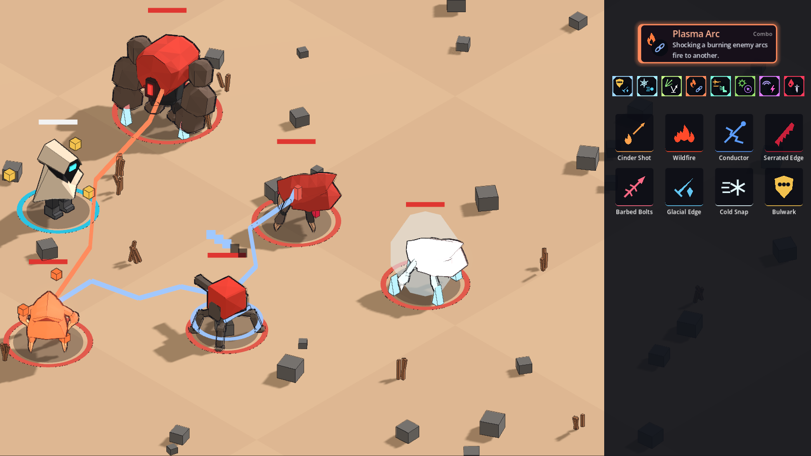

# COMBOS: do the engines stack, pay off and stay bounded, and do the combos unlock and show?

- **Status:** RUN (render, full suite, export smoke); how the engines and combos feel is OWNER ONLY
- **Build:** the working tree of the commit that adds this file (`v0.3.0 Step G`), parent `fa36184`, on the
  workstream branch `worktree-agent-ab801bdc90e9788b3`; Godot `4.7.2.stable.official.ed1daf0bf`; OS
  `Linux 6.18.44-fc-v77` (cloud container, llvmpipe Vulkan for the render)
- **Date:** 2026-10-07
- **Who ran it:** agent

Owner line L8 (v0.3.0 PLAN, Q2 "Both"): engines (burn, shock, bleed, frost, guard charges) and named combos. The
design, every number (starting values) and the full item × item table are in
[`../../../design/INTERACTIONS.md`](../../../design/INTERACTIONS.md).

## Command (render)
```
VK_ICD_FILENAMES=/usr/share/vulkan/icd.d/lvp_icd.json xvfb-run -a -s "-screen 0 1920x1080x24" godot --path . --audio-driver Dummy --resolution 1600x900 -s scripts/shots/combos.gd
cp build/shots/v0.3.0/combos/combos.png docs/roadmap/v0.3.0/evidence/combos.png
```

## Raw output (render)
```
Godot Engine v4.7.2.stable.official.ed1daf0bf - https://godotengine.org
Vulkan 1.4.318 - Forward+ - Using Device #0: Unknown - llvmpipe (LLVM 20.1.2, 256 bits)
combos: renderer=forward_plus device=llvmpipe (LLVM 20.1.2, 256 bits)
combos: statuses burn=5 shock=3/5 bleed=8 frost=3/4 frozen=true charges=3
combos: res://build/shots/v0.3.0/combos/combos.png 1600x900
combos: res://build/shots/v0.3.0/combos/combos_small.png 1200x675
```
`combos.png` is 228,605 bytes.



The statuses are set on a still world (no ticks), one per enemy, so each shows at a known count: the orange-tinted
Charger (bottom left) burns at 5 stacks (embers); the Needle (centre) carries 3 of 5 shock pips over its health bar
and the blue lightning of a discharge to two neighbours; the middle Charger bleeds at 8 stacks (red drips); the
Warden (top) has 3 of 4 frost crystals; the white Charger (right) is frozen (ice shell, icy tint); the wanderer has
3 guard charges (gold cubes circling). The orange line is a Plasma Arc. On the right: the Plasma Arc combo card (a
full frame in the combo's colour, both items' icons), the 8 combo badges as the HUD shows them, and the 8 new item
icons with their names.

## Command (full suite, lint)
```
gdformat --check src scripts tests && gdlint src scripts tests
bash scripts/verify.sh
```

## Raw output (trimmed to the result lines)
```
216 files would be left unchanged
Success: no problems found
REPLAY| final=5171fdadd6442c3e5c568273b2fcb361fa5f19fddd3e922231fe6c4bb3d841ae
SOAK| kills=181 events=7891 most_in_a_tick=42 limits=0 (watchdog 0, heal cap 0)
SOAK| shock_discharge=215 (in the last 4096 events)
SOAK| bleed=421 (in the last 4096 events)
SOAK| freeze=16 (in the last 4096 events)
SOAK| plasma_arc=936 (in the last 4096 events)
SOAK| resonance=6 (in the last 4096 events)
Scripts              71
Tests               362
Passing Tests       362
Asserts           201799
Time              135.61s
---- All tests passed! ----
check_gut_log: ok (362 passing, minimum 362)
```
The `SOAK|` lines come from `tests/unit/sim/test_combos.gd` (all 24 items and 8 combos, the guard, six real enemies
kept alive, walls, scripted swings, shots, dashes and guarding, 5,000 ticks, run twice for the same hash). The
per-effect numbers count **events** carrying that effect id (STATUS_APPLY, HIT and DAMAGE alike) in the event log,
not payoffs; the label's "last 4096" understates the log, which held all 7,891 events here. The replay golden's
final hash is unchanged by this step (the engine state is hashed only when the loadout has items; see below).

## Command (export smoke, run from outside the project folder)
```
cd /tmp && bash <worktree>/scripts/ci/export_smoke.sh
```

## Raw output
```
manifest: f804b0c205ff094c7a2873626242870fa7c2142cc2a9da465a44528d10f0c695 (43 files, 0 errors)
Godot Engine v4.7.2.stable.official.ed1daf0bf - https://godotengine.org
Export smoke check (exported pack)
  ok    running inside the exported pack (run from outside the project folder)
  ok    the main scene ships
  ok    600-tick World run hash 9c324d3dbf34 matches the project's
  ok    content player: 1
  ok    content biomes: 1
  ok    content validates inside the pack (0 errors)
  ok    manifest hash f804b0c205ff matches the project's
  ok    Spanish translation is loaded
  ok    UI_PLAY is PLAY / JUGAR
  ok    the test framework is not shipped
  ok    tests are not shipped
0 miss(es)
```

## Goldens
None changed. The new per-actor statuses (`ActorStore.STATUS_FIELDS`) and the engine/combo World fields are hashed
in `World._hash_engines`, which runs only when the world's loadout has items; the replay and export-smoke worlds
have none, so their hashes (`5171fdad…`, `9c324d3d…`) are as before.

## Not run / open
- The owner's playtest of engines and combos: OWNER ONLY.
- Windows: not run locally (Linux container); CI covers the suite on Windows.
