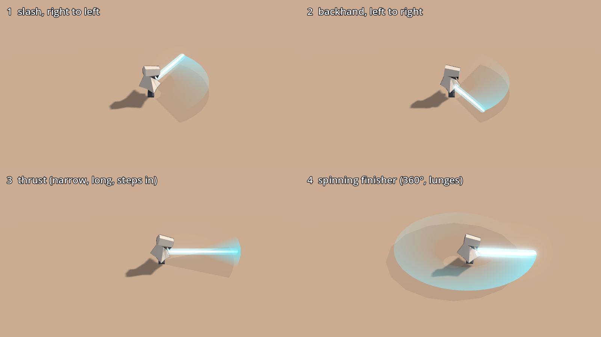

# FOUR_SLASHES: does the melee play as four distinct slashes, and does each draw the shape it hits with?

- **Status:** RUN (render, unit tests, e2e); the feel is OWNER ONLY
- **Build:** the working tree of the commit that adds this file (`v0.3.0 Step N`), parent `0ea126b`, on the
  workstream branch `worktree-agent-a40ee722395a9c81b`; Godot `4.7.2.stable.official.ed1daf0bf`; OS
  `Linux 6.18.44-fc-v77` (cloud container, llvmpipe Vulkan for the render)
- **Date:** 2026-10-07
- **Who ran it:** agent

Owner line L11 (v0.3.0 PLAN): "sword should be a 4 moment combo, composed of 4 different kind of slashes the 4th
being stronger".

## The steps (starting values, `data/player/runner.tres`)
Ticks at 60 Hz. The swing hits once, on its active tick; the recovery runs from the hit to the swing's end, then
the combo window (12 ticks) opens, except after the finisher (the combo starts over). The lunge is spread over the
ticks before the hit. Reach is beyond the wanderer's edge (own radius 0.35 m).

| Step | Motion (blade) | Total ticks | Active tick | Recovery | Arc | Reach | Damage | Hit-stop | Lunge | Sweep (view) |
|---|---|---|---|---|---|---|---|---|---|---|
| 1 | horizontal slash, right → left | 13 | 2 | 11 | 120° (±60°) | 1.6 m | 10 | 3 | 0 m | 5 |
| 2 | backhand, left → right | 14 | 3 | 11 | 120° (±60°) | 1.6 m | 10 | 3 | 0 m | 5 |
| 3 | forward thrust (stab + narrow streak) | 16 | 4 | 12 | 40° (±20°) | 2.3 m | 12 | 4 | 0.35 m | 4 |
| 4 | spinning finisher (one full turn, brighter, flare on hit) | 31 | 7 | 24 | 360° | 1.9 m | 24 | 7 | 0.6 m | 9 |

Items that read the combo: **Overcharge** charges every 4th swing *of the combo*, so it is always the finisher
(24 × 2 = 48 and a 12-damage shockwave); a lapsed window restarts the count with the combo, so it never drifts onto
a slash. Its card now reads "Your finisher hits double and sends a shockwave." / "Tu remate hace el doble y lanza
una onda." **Twin Arc** echoes the swung step's own arc (`World.echo_step`). **Long Edge** multiplies every step's
reach by 1.35. **Momentum** multiplies whichever step it empowers (a finisher: 24 × 1.6 = 38).

## Command (render)
```
VK_ICD_FILENAMES=/usr/share/vulkan/icd.d/lvp_icd.json xvfb-run -a -s "-screen 0 1920x1080x24" godot --path . --audio-driver Dummy --resolution 1600x900 -s scripts/shots/four_slashes.gd
cp build/shots/v0.2.0-dev/four_slashes/four_slashes.png docs/roadmap/v0.3.0/evidence/four_slashes.png
```

## Raw output (render)
```
Godot Engine v4.7.2.stable.official.ed1daf0bf - https://godotengine.org
Vulkan 1.4.318 - Forward+ - Using Device #0: Unknown - llvmpipe (LLVM 20.1.2, 256 bits)
STEP| step motion ticks active recovery half_arc_units arc_deg reach_m damage hitstop lunge_m sweep
STEP| 1 0 13 2 11 683 120.1 1.60 10 3 0.00 5
STEP| 2 1 14 3 11 683 120.1 1.60 10 3 0.00 5
STEP| 3 2 16 4 12 228 40.1 2.30 12 4 0.35 4
STEP| 4 3 31 7 24 2048 360.0 1.90 24 7 0.60 9
SHOT| /home/user/zero-depth/.claude/worktrees/agent-a40ee722395a9c81b/build/shots/v0.2.0-dev/four_slashes/four_slashes.png
```
(The label says `v0.2.0-dev` because `project.godot` still carries that version string; `arc_deg` is the compiled
half arc doubled, so 120.1 is 683/4096 of a turn × 2.)



Each cell is captured at the end of its step's sweep. The faint dark wedge on the ground is the step's hit arc
from `WorldReader.swing_shape(step)` (the numbers `PlayerKit` hits with); the blade's tip and trail sit on it.
Slash 1 ends on the wanderer's left (screen up), slash 2 on the right (screen down), the thrust is a single straight
stab with a cyan streak over its ±20°, and the finisher leaves a full ring.

## Command (e2e, through `main.tscn` with `Input.parse_input_event` only)
```
godot --headless --fixed-fps 60 --path . -s addons/gut/gut_cmdln.gd -gtest=res://tests/e2e/test_e2e_four_slash.gd -gexit
```

## Raw output (e2e, three runs, trimmed to the result lines)
```
    swings (step, hits, damage): [[0, [10], 10], [1, [10], 10], [2, [12], 12], [3, [24], 24]]
Passing Tests         1
    swings (step, hits, damage): [[0, [10], 10], [1, [10], 10], [2, [12], 12], [3, [24], 24]]
Passing Tests         1
    swings (step, hits, damage): [[0, [10], 10], [1, [10], 10], [2, [12], 12], [3, [24], 24]]
Passing Tests         1
```

## Command (full suite)
```
bash scripts/verify.sh
```

## Raw output (full suite, trimmed to the summary)
```
[… trimmed …]
Totals
------
Scripts              66
Tests               310
Passing Tests       310
Asserts           131362
Time              61.573s

---- All tests passed! ----

Results saved to build/gut.xml
check_gut_log: ok (310 passing, minimum 279)
```

## Result
| Check | Measured | Pass? |
|---|---|---|
| Four presses in the window are steps 0, 1, 2, 3 in the real game | `[0, 1, 2, 3]` | yes |
| Each lands; the 4th hits for the finisher's damage | 10, 10, 12, **24** | yes |
| Each step's blade draws its own step's arc and reach | unit tests (`test_four_slash_view.gd`) + the render | yes |
| Full suite | 310 / 310 | yes |
| How the four slashes feel (timing, weight, the finisher's recovery) | — | OWNER ONLY |

## Interpretation
The combo is data (`SwingStepDefinition` × 4) and every number above is a starting value. The finisher's 24-tick
recovery (0.4 s, no new swing) is the trade for its 360° and double damage; the owner should judge whether it feels
heavy or sluggish. The render is a still per step; the motion (the stab, the spin, the body's twist and lunge) is
best judged in the build.
