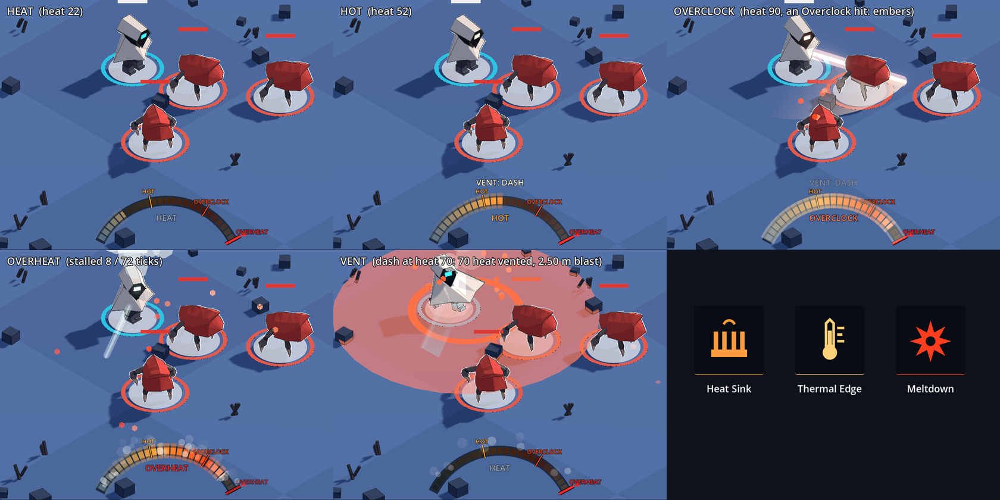

# v0.3.0 Step H: Overclock heat (evidence)

Build: the tree of the Step H commit, on `claude/lucid-fermat-9wv2tf` at `5e24bf7` plus this step's changes (the
runs below were made on that working tree before committing; `tests/MIN_TEST_COUNT` was raised from 482 to 506
in the same commit). Design and every number: [`../../../design/SIGNATURE.md`](../../../design/SIGNATURE.md)
§Overclock. All numbers are starting values.

## What was built
- Heat 0–100 in the sim (milli-points, hashed only when the loadout has heat): +2.5 per landed combo step, +5 per
  finisher, +0.9 per landed bolt; held 1 s after the last gain, then −15/s.
- Hot (≥ 40): blade reach +20 %, bolts pierce one enemy. Overclock (≥ 75): +25 % damage on your swings and bolts,
  embers, +1 burn stack per hit with a burn item. Overheat at 100: 1.2 s stall (60 % speed, no attacks), heat drains.
- Vent: a dash (where it starts) or a blink (where it lands) while Hot blasts 2.5 m for heat × 0.5, heat → 0. A
  payoff (ancestry, no stacks, no heat).
- Items: Heat Sink (common: vent +50 % damage, +30 % radius), Thermal Edge (common: Hot at 30), Meltdown (rare:
  overheat explodes as a 100-heat blast, no stall). Tag `heat`; offered only in runs with heat.
- HUD meter (bottom centre), visor and blade heat colours, vent ring and disc, steam, embers.



Tiles (left to right, top to bottom): cool at 22 heat (steel segments, HOT / OVERCLOCK notches, the red OVERHEAT
bar and arrow at the end); Hot at 52 with the VENT: DASH prompt; Overclock at 90 after an Overclock swing (embers
off the hit enemy, the blade near white); overheat 8 ticks into the 72-tick stall (the word OVERHEAT, steam from
the arc, the bar draining, white visor); a dash vent at 70 heat (the 2.5 m disc and ring, embers, the meter empty);
the three heat item icons. The heat is set on the world between tiles; the Overclock hit, the overheat and the
vent come from real ticks (a swing press, a swing landing at 99 heat, a dash press).

## Commands
```
gdformat --check src scripts tests && gdlint src scripts tests
bash scripts/verify.sh
cd /tmp && bash <worktree>/scripts/ci/export_smoke.sh
VK_ICD_FILENAMES=/usr/share/vulkan/icd.d/lvp_icd.json xvfb-run -a -s "-screen 0 1920x1080x24" godot --path . --audio-driver Dummy --resolution 1600x900 -s scripts/shots/heat.gd
```

## Raw output (trimmed to the result lines)
```
281 files would be left unchanged
Success: no problems found
REPLAY| final=5171fdadd6442c3e5c568273b2fcb361fa5f19fddd3e922231fe6c4bb3d841ae
    heat peak 50.0, ready true at tick 3412
    vented 50 heat, 1 blast hit(s)
    blade: Hot at 4.60 s, Overclock at 8.60 s
    gun: Hot at 5.17 s, Overclock at 9.72 s
Scripts              90
Tests               506
Passing Tests       506
Asserts           403147
Time              847.372s
---- All tests passed! ----
check_gut_log: ok (506 passing, minimum 482)
```
```
manifest: 317e2b907397506affe67beea82d100cb970ce91f2410daec144ecd8ba8a8add (58 files, 0 errors)
  ok    600-tick World run hash 9c324d3dbf34 matches the project's
  ok    content validates inside the pack (0 errors)
  ok    manifest hash 317e2b907397 matches the project's
0 miss(es)
```
The `heat peak` / `vented` lines are `tests/e2e/test_e2e_heat.gd` (main.tscn, pad input only: walk, aim, swing
until Hot, the right bumper to dash; the blast hit the enemy beside the wanderer for 25, heat went to 0, the meter
emptied and the view drew the ring at the sim's 2.5 m). The `Hot at` lines are the tuning test in
`tests/unit/sim/test_heat.gd` (mashing against a still target).

## Goldens
None changed. The replay golden's final hash is the same as before this step (`5171fdad…`) and the export smoke's
600-tick hash matches its fixture: worlds without heat (`World.heat` null) hash exactly as before.

## Found while testing (for the owner)
In the real game on floor 1 the e2e bot (it swings at the nearest enemy and never dodges) stayed under Hot for
the first ~30 s: enemies arrive one at a time, die in a few swings, and the walk to the next one lets heat decay
(it peaked at exactly 40.0 once, at about 32 s, and the bot died at about 54 s). With God mode on and the floor
filling up it reached 50 at tick 3412 (about 57 s). So with these numbers Hot and Overclock come in crowded
fights, not against lone early enemies. Whether that is right (or the gain should rise / the decay wait longer)
is an owner call after playing.

## Owner playtest
Feel, fun and the meter's readability: OWNER ONLY.
